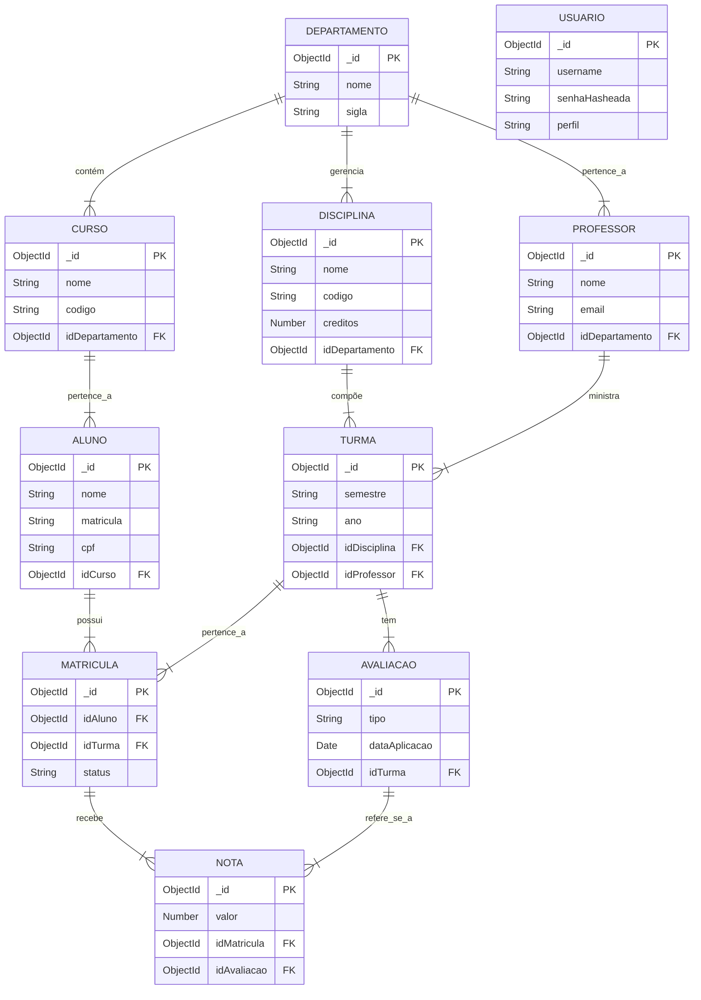

Este é um excelente modelo de `README.md`. Vou integrar o diagrama de entidade-relacionamento (DER) em código **Mermaid.js** para representar as 10 entidades do seu **Sistema Acadêmico Universitário**, seguindo a estrutura lógica e de relacionamentos esperada.

O código será inserido na seção **Modelagem de Dados** do seu README.

-----

## 📐 Diagrama de Entidade-Relacionamento (Mermaid)

O diagrama abaixo ilustra as 10 coleções, seus campos chave e os relacionamentos principais (1:N, 1:1) que regem a lógica do sistema acadêmico.



-----

## 📄 README.md Completo

Aqui está o conteúdo do seu `README.md` com a nova seção **Modelagem de Dados** preenchida.

````markdown
# Trabalho A2 de Construção de Backend – Sistema Acadêmico Universitário

## 📖 Descrição

Este projeto consiste na implementação de uma API REST completa com operações CRUD (Create, Read, Update, Delete), utilizando Node.js, Express, Mongoose e Yup. 
O tema escolhido é o **Sistema Acadêmico de Universidade**, abrangendo o gerenciamento de 10 entidades: Alunos, Professores, Cursos, Departamentos, Disciplinas, Turmas, Matrículas, Avaliações, Notas e Usuários do Sistema.

Este trabalho foi desenvolvido para a disciplina de **Construção de Backend**.

## 🛠️ Tecnologias Utilizadas

O projeto foi desenvolvido utilizando as seguintes tecnologias e bibliotecas:

* **Node.js** (Ambiente de execução)
* **Express** (Framework web)
* **MongoDB Atlas** (Banco de dados na nuvem)
* **Mongoose** (ODM para modelagem e persistência de dados)
* **Yup** (Validação de esquemas e dados)
* **Dotenv** (Gerenciamento de variáveis de ambiente)
* **Bcryptjs** (Criptografia de senhas para a coleção de Usuários)
* **Nodemon** (Monitoramento e reinício automático do servidor)

---

### Breve Descrição das Collections e Relacionamentos

  * **Departamentos** gerenciam **Cursos**, **Professores** e **Disciplinas**.
  * **Alunos** estão vinculados a um **Curso**.
  * **Turmas** são compostas por uma **Disciplina** e ministradas por um **Professor**.
  * A **Matrícula** é a junção de um **Aluno** em uma **Turma**.
  * **Avaliações** são criadas dentro de uma **Turma**.
  * **Notas** estão vinculadas a uma **Matrícula** específica para uma **Avaliação** realizada.
  * A coleção **Usuários** é separada e usada para autenticação e segurança do sistema.

-----

## 👥 Alunos e Contribuições

| Aluno(a) | GitHub | Collections/CRUDs Desenvolvidos | Funcionalidades Implementadas |
| :--- | :--- | :--- | :--- |
| **Álvaro Matheus Alves da Silva** | [alvarotheuzin](https://github.com/alvarotheuzin) | **Alunos** | Implementação completa do CRUD de Alunos, Validação de CPF e Endereço, Criação do `IDValidator.js`. |
| **Giovanna Martins Soares** | [blackinha](https://github.com/Blackinha) | **Professores** | Implementação do CRUD de Professores, Definição do relacionamento com Departamento, Criação do `ErrorHandler.js`. |
| **João Victor Pereira de Souza** | [JoaooVictor27](https://github.com/JoaooVictor27) | **Cursos** | Implementação do CRUD de Cursos, Criação do `Database.js` para conexão com o MongoDB Atlas, Criação do `validate.js` (middleware Yup). |
| **Maria Fernanda Santos Lima de Almeida** | [fe705](https://github.com/fe705) | **Departamentos** | Implementação do CRUD de Departamentos, Configuração das variáveis de ambiente (`.env`), Definição da estrutura inicial do `routes.js`. |
| **Pedro Victor Lopes de Souza** | [Crowzito](https://github.com/Crowzito) | **Disciplinas, Turmas, Matrículas, Avaliações, Notas, Usuários** | Implementação de 6 CRUDs Transacionais e Auxiliares, Lógica de relacionamento complexa (Notas/Matrículas/Avaliações), Implementação do Bcryptjs para hashing de senhas de Usuários. |

-----

## 🤝 CONTRIBUTING

Para detalhes sobre como contribuir com este projeto, seguir nosso fluxo de trabalho e padrões de commit, por favor leia nosso guia de contribuição:

➡️ **[CONTRIBUTING.md](https://www.google.com/search?q=CONTRIBUTING.md)**

-----

## 🚀 Como Rodar o Projeto

### Comunicação com o Banco de Dados

O projeto utiliza o **MongoDB Atlas** para persistência de dados. A conexão é gerenciada pelo Mongoose e as credenciais são lidas a partir do arquivo `.env`.

1.  **Clone o repositório:**
       `bash    git clone https://github.com/Crowzito/sistema-academico.git    `

2.  **Navegue até o diretório do projeto:**

   `bash    cd sistema-academico    `

3.  **Instale as dependências:**

   `bash    npm install    `

4.  **Configure o arquivo `.env`:**

   \* Copie o `.env.example` para `.env`
   \* Insira sua `MONGO_URI` completa (com usuário, senha e host do Atlas)

5.  **Inicie o servidor:**

   `bash    npm start    `

O servidor estará rodando em:
👉 `http://localhost:3000/api`

-----

## 🔌 Endpoints da API

Abaixo estão todos os endpoints disponíveis para as funcionalidades do sistema acadêmico, seguindo as convenções RESTful.

### **Alunos** (`/alunos`)

  * `GET /alunos` – Lista todos os alunos
  * `GET /alunos/:id` – Obtém um aluno pelo ID
  * `POST /alunos` – Cria um novo aluno (Exemplo de Body: `{"nome": "...", "matricula": "...", "idCurso": "..."}`)
  * `PUT /alunos/:id` – Atualiza um aluno existente
  * `DELETE /alunos/:id` – Remove um aluno

### **Professores** (`/professores`)

  * `GET /professores` – Lista todos os professores
  * `GET /professores/:id` – Busca um professor pelo seu ID
  * `POST /professores` – Cria um novo professor (Exemplo de Body: `{"nome": "...", "email": "...", "idDepartamento": "..."}`)
  * `PUT /professores/:id` – Atualiza um professor
  * `DELETE /professores/:id` – Remove um professor

### **Cursos** (`/cursos`)

  * `GET /cursos` – Lista todos os cursos
  * `GET /cursos/:id` – Obtém um curso pelo ID
  * `POST /cursos` – Cria um novo curso (Exemplo de Body: `{"nome": "Engenharia Civil", "idDepartamento": "..."}`)
  * `PUT /cursos/:id` – Atualiza um curso
  * `DELETE /cursos/:id` – Remove um curso

### **Departamentos** (`/departamentos`)

  * `GET /departamentos` – Lista todos os departamentos
  * `GET /departamentos/:id` – Obtém um departamento pelo ID
  * `POST /departamentos` – Cria um novo departamento (Exemplo de Body: `{"nome": "Ciências Exatas"}`)
  * `PUT /departamentos/:id` – Atualiza um departamento
  * `DELETE /departamentos/:id` – Remove um departamento

### **Disciplinas** (`/disciplinas`)

  * `GET /disciplinas` – Lista todas as disciplinas
  * `GET /disciplinas/:id` – Obtém uma disciplina pelo ID
  * `POST /disciplinas` – Cria uma disciplina (Exemplo de Body: `{"nome": "Cálculo I", "creditos": 4, "idDepartamento": "..."}`)
  * `PUT /disciplinas/:id` – Atualiza uma disciplina
  * `DELETE /disciplinas/:id` – Remove uma disciplina

### **Turmas** (`/turmas`)

  * `GET /turmas` – Lista todas as turmas
  * `GET /turmas/:id` – Obtém uma turma específica
  * `POST /turmas` – Cria uma nova turma (Exemplo de Body: `{"semestre": "2024.2", "idDisciplina": "...", "idProfessor": "..."}`)
  * `PUT /turmas/:id` – Atualiza uma turma existente
  * `DELETE /turmas/:id` – Remove uma turma

### **Matrículas** (`/matriculas`)

  * `GET /matriculas` – Lista todas as matrículas
  * `GET /matriculas/:id` – Busca uma matrícula específica
  * `POST /matriculas` – Realiza uma nova matrícula (Exemplo de Body: `{"idAluno": "...", "idTurma": "..."}`)
  * `PUT /matriculas/:id` – Atualiza uma matrícula
  * `DELETE /matriculas/:id` – Remove uma matrícula

### **Avaliações** (`/avaliacoes`)

  * `GET /avaliacoes` – Lista todas as avaliações
  * `GET /avaliacoes/:id` – Obtém uma avaliação específica
  * `POST /avaliacoes` – Cria uma nova avaliação (Exemplo de Body: `{"tipo": "Prova 1", "idTurma": "..."}`)
  * `PUT /avaliacoes/:id` – Atualiza uma avaliação
  * `DELETE /avaliacoes/:id` – Remove uma avaliação

### **Notas** (`/notas`)

  * `GET /notas` – Lista todas as notas
  * `GET /notas/:id` – Obtém uma nota pelo ID
  * `POST /notas` – Registra uma nova nota (Exemplo de Body: `{"valor": 8.5, "idMatricula": "...", "idAvaliacao": "..."}`)
  * `PUT /notas/:id` – Atualiza uma nota
  * `DELETE /notas/:id` – Remove uma nota

### **Usuários** (`/usuarios`)

  * `GET /usuarios` – Lista todos os usuários
  * `GET /usuarios/:id` – Detalha um usuário
  * `POST /usuarios` – Cria um usuário (Exemplo de Body: `{"username": "admin", "senha": "..."}`)
  * `PUT /usuarios/:id` – Atualiza um usuário
  * `DELETE /usuarios/:id` – Remove um usuário

```
